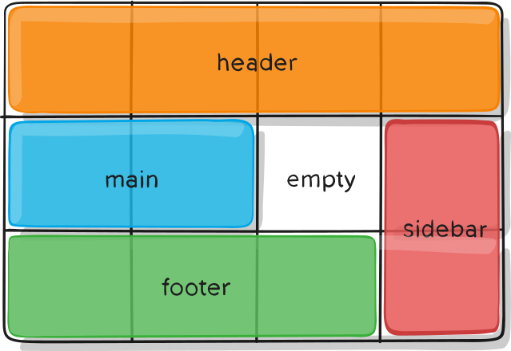
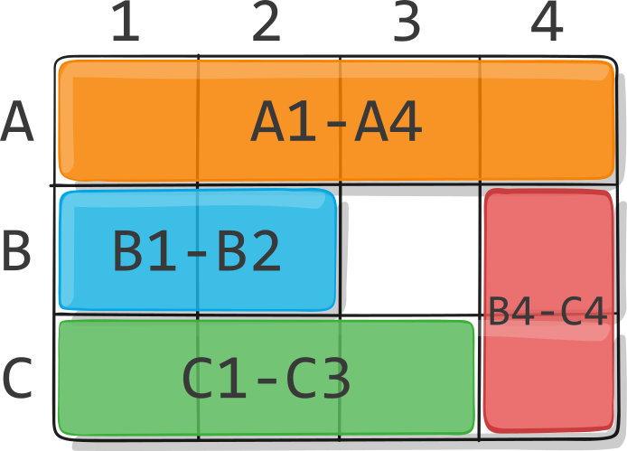
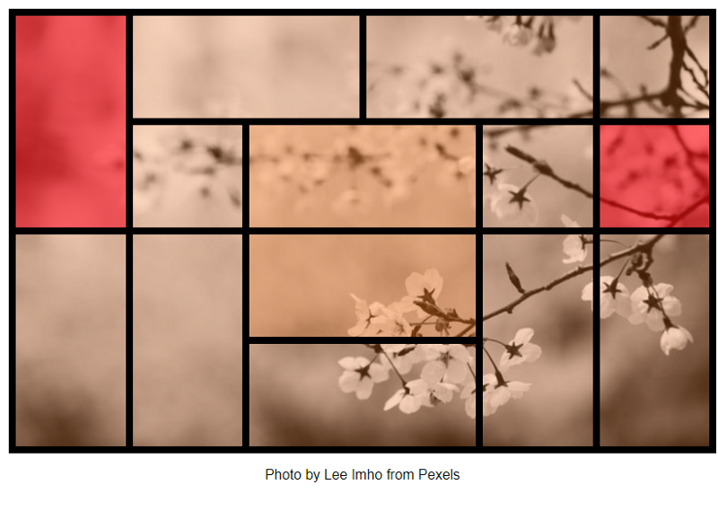

# Creating a Powerful Excel-inspired Grid Framework with SASS

Photo by [Hilary Susan Osman ](https://www.pexels.com/@hilary-susan-osman-777344?utm_content=attributionCopyText&utm_medium=referral&utm_source=pexels)from [Pexels](https://www.pexels.com/photo/red-orange-glass-window-1669018/?utm_content=attributionCopyText&utm_medium=referral&utm_source=pexels)

Look at this picture and imagine that was the web page layout your client asked for; and of course, it has to be responsive. Would you like to have a simple way to describe that structure, but at the same time have the flexibility to adapt to any resolution? Keep reading.

## The inspiration

While (re)learning CSS, specifically CSS layouts, I came to a topic I haven’t heard before: [CSS Grids](https://css-tricks.com/snippets/css/complete-guide-grid/). And while checking all the material available, I was referred by a friend to this video of a conference given by **Morten Rand-Hendriksen:** [**CSS Grid Changes Everything (About Web Layouts)**](https://www.youtube.com/watch?v=txZq7Laz7_4) where he said, around 43:40, something that would resonate later in my head: “Y*ou in this room can build a new better framework based on CSS grid*.”

Later on, in my journey learning CSS, I came to a project where I was supposed to build a grid framework mimicking the behavior of Bootstrap. Here’s when those words came back to my head and I decided I would make one of the unwritten objectives of this framework to give the user a simpler and nicer way to deal with grids using HTML & CSS.

## The model

So, my next step was to come up with a way of accomplishing this. As usual, easier said than done but, as always, the best way to get there is by taking baby steps. I decided to try first to use the same notation and behavior as Bootstrap, so I build a piece of simple SASS code to create the classes to achieve this.

Very early I learned that, instead of using the Bootstrap notation of **col-{media breakpoint}-{column number}** it would be easier and more natural for a CSS grid to use an extended version like **col-{media breakpoint}-{start column number}-{end column number}** because that’s exactly how grid columns work, and this had the advantage (compared to Bootstrap) that I would have to create neither an [offset class](https://getbootstrap.com/docs/4.0/layout/grid/#offset-classes) nor an [order class](https://getbootstrap.com/docs/4.0/layout/grid/#order-classes) because that would be implicit in the notation.

Instead of using:

```html
<div class="row">
  <div class="col-md-4">Leftmost four columns</div>
  <div class="col-md-4 offset-md-4">Rightmost four columns</div>
</div>
```

I could just use:

```html
<div class="row">
  <div class="col-md-1-4">Leftmost four columns</div>
  <div class="col-md-9-12">Rightmost four columns</div>
</div>
```

And if I wanted to swap the two div’s positions on different media breakpoints, I could simply use:

```html
<div class="row">
  <div class="col-md-1-4 col-lg-9-12">Leftmost four columns</div>
  <div class="col-md-9-12 col-lg-1-4">Rightmost four columns</div>
</div>
```

Simple and elegant! (at least that’s what I tell myself)

But having reached this point, as many times it happens to me (and I’m sure to many of you out there), while walking my dog an idea popped in my head: How about using an Excel-like notation to define, not a row, but the grid itself? I thought of this Excel-like notation because it’s very familiar to most people who have used Excel at some point in their lives (and that’s a lot of people) and it allows ranges to be expressed in a simple but powerful way.

Take this example from [css-tricks.com, «A Complete Guide to Grid»](https://css-tricks.com/snippets/css/complete-guide-grid/):

[](https://css-tricks.com/snippets/css/complete-guide-grid/)

The ranges can be expressed as:



So the notation could be something like this:

```html
<div class="grid">
  <div class="range-md-A1-A4">Header</div>
  <div class="range-md-B1-B2">Main</div>
  <div class="range-md-B4-C4">Sidebar</div>
  <div class="range-md-C1-C3">Footer</div>
</div>
```

And if you wanted, for example, to move the sidebar to the left on the large breakpoint you would use:

```html
<div class="grid">
  <div class="range-md-A1-A4 range-lg-A1-A4">Header</div>
  <div class="range-md-B1-B2 range-lg-B3-B4">Main</div>
  <div class="range-md-B4-C4 range-lg-B1-C1">Sidebar</div>
  <div class="range-md-C1-C3 range-lg-C2-C4">Footer</div>
</div>
```

Using this notation you can have a simple yet very powerful grid framework!

## The design

Now, before deciding the size of the grid that we will be supporting, let’s analyze the case of one row. If you had one row with 12 columns (like Bootstrap does) you would have:

[](https://en.wikipedia.org/wiki/1_%2B_2_%2B_3_%2B_4_%2B_⋯)

[Sum of numbers from 1 to 12 inclusive](https://en.wikipedia.org/wiki/1_%2B_2_%2B_3_%2B_4_%2B_⋯)

That means we need 78 classes to describe a single row with 12 columns in the style **col-{media breakpoint}-{start column number}-{end column number}**. But when we increase the vertical dimension, this calculation turns a little bit more complex since we will omit duplicated references (the range **a1-b2** is the same as **b2-a1**), but a simple table should suffice:


Generated classes depending on Rows and Columns

We can see how the number of classes increases dramatically with the addition of a row or a column above 4x4; but for practical purposes, a 4x4 table won’t be of much use. I decided to go for a **6x4** grid for two reasons:

First, this gives me some nice equilibrium when dividing the columns (I can have symmetric columns with 1,2,3 and 6, and asymmetric with 4 and 5) and the rows (I can split vertically in half or fourths, keeping a header and footer zone).

Second, these containers can be nested, so any of these cells can, in turn, behave like a grid, and in that way my design can grow indefinitely.

## The proof of concept

[This first demo](https://rawcdn.githack.com/oscarnava/Excel-style-grid/b8b31ff67cb5c31b7f5e61806b9b8763b2b6a2df/index.html) shows the above layout with different media breakpoints like those used by Bootstrap. Open it in a separate window and try resizing the window to check out the behavior.

[The second demo](https://rawcdn.githack.com/oscarnava/Excel-style-grid/871aefb58e951e126b8c905d33f34f21b879fd44/vitral.html) reproduces the central panel of the stained glass layout shown at the start of this article (check below for the code).

## The code

You can check the code for this basic framework, as for the demos in this GitHub link: https://github.com/oscarnava/Excel-style-grid

In case you want to check the core of the framework, it’s comprised in these lines of code:

```scss
  @each $name, $dimension-min, $dimension-max in $MEDIA-BREAKPOINTS {
    @media only screen and (min-width: $dimension-min) {
      @for $top from 1 through length($ROWS) {
        @for $left from 1 through $COLS {
          @for $bottom from $top through length($ROWS) {
            @for $right from $left through $COLS {
              $top-name: nth($ROWS,$top);
              $bottom-name: nth($ROWS,$bottom);
              .range-#{$name}-#{$top-name}#{$left}#{$bottom-name}#{$right} {
                grid-column: #{$left}/#{$right + 1};
                grid-row: #{$top}/#{$bottom + 1};
              }
            }
          }
        }
      }
    }
  }
```

These five nested loops generate all the class definitions.

And these are the global definitions that control the columns, rows, and media breakpoints rules generated:

```scss
$COLS: 6;
$ROWS: (A,B,C,D);
$MEDIA-BREAKPOINTS: (
  (sm,  576px,   767px),
  (md,  768px,   991px),
  (lg,  992px,  1199px),
  (xl, 1200px, 99999px),
);
```

By changing these and recompiling the code you can generate any custom grid layout that fits your needs. Just remember to check the table above to make sure you don’t generate an excessive number of class definitions.

## The conclusion

Although simple and immature, this sketch of a framework already shows its power. For example, to answer the theoretical question asked at the beginning of this article, the layout of the central panel of that window can be described with this code:

```html
<div class="excel-grid">
    <div class="grid">
        <div class="range-md-A1B1"></div>
        <div class="range-md-A2A3"></div>
        <div class="range-md-A4A5"></div>
        <div class="range-md-A6A6"></div>
        <div class="range-md-B2B2"></div>
        <div class="range-md-B3B4"></div>
        <div class="range-md-B5B5"></div>
        <div class="range-md-B6B6"></div>
        <div class="range-md-C1D1"></div>
        <div class="range-md-C2D2"></div>
        <div class="range-md-C3C4"></div>
        <div class="range-md-D3D4"></div>
        <div class="range-md-C5D5"></div>
        <div class="range-md-C6D6"></div>
    </div>
</div>
```

And this is the result:



Considering most of the code is HTML, and the real essence of the layout is contained in the Excel-style class names, this is a nice approach. Also, after creating the 14 inner div’s, it took me about 5 to 10 minutes to place each panel in its corresponding position in the window (and I’m a slow typist 😄).

---

## 🛠 Built with:
- **SASS** *(I like indentation based languages)*
- **HTML** (only for the demos)
- ☕ Coffee, and more coffee!

---
[](https://www.microverse.org/)

## 👤 Contributors

- [Oscar Nava](https://github.com/oscarnava) 📧 contact@oscarnava.me

## 🔧 Installing

Just clone the repository to your local development machine, and use your preferred ***SASS*** compiler. Personally I would recommend [***Koala***](http://koala-app.com/), a very versatile freeware. Check it out!

## ⌛ Todo's

- [ ] Create a tutorial to teach the use and customization of this framework.

## 📦 Contributing
Contributions, issues and feature requests are welcome!

Feel free to check the [issues page](https://github.com/oscarnava/Battleship/issues).

## 🗝 License
Creative Commons [Attribution 4.0 International (CC BY 4.0)](https://creativecommons.org/licenses/by/4.0/).

## 📡 Contact

Please don't hesitate to contact me at 📧 [contact@oscarnava.me](mailto:contact@oscarnava.me) if you have any questions, comments, etc. I would love to know what's on your mind!
